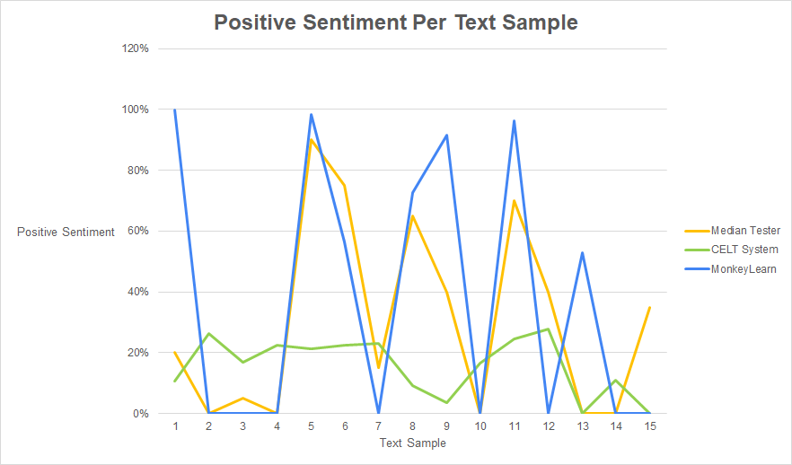
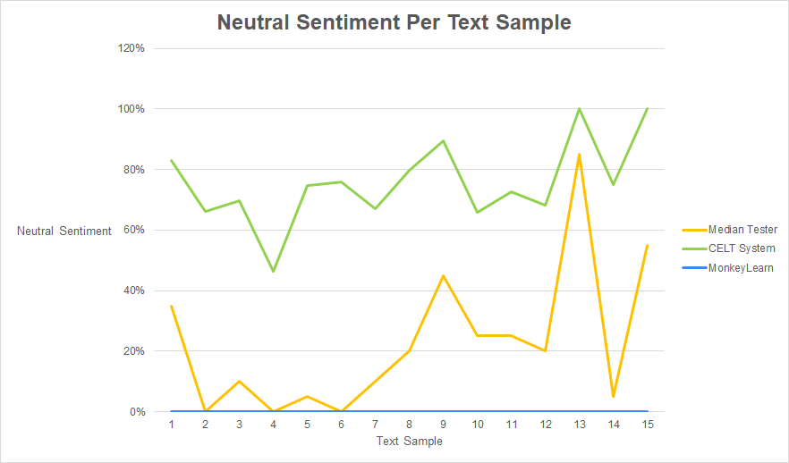
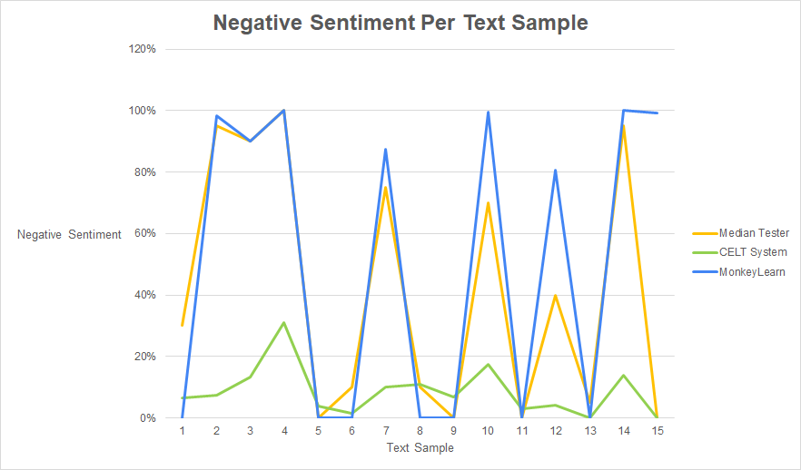
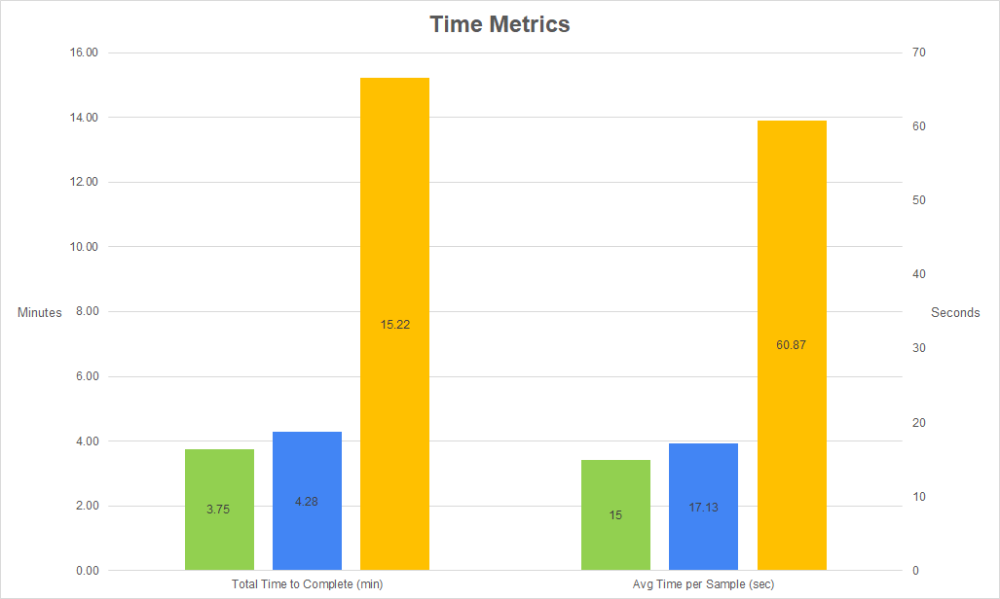

# Group 9 Project 3 Report

## Project Description
CELT is a sentiment analyzer with the goal of accurately predicting a user's sentiment by analyzing data provided over many different input sources (text and audio). The project is designed with open source in mind and makes use of the MIT license. This application is practical and is an easily testable project.

## Testing Methodology
The objective of project 3 is to test and evaluate CELT sentiment analyzer platform. This is accomplished by comparing the results obtained from the CELT platform with results obtained from human participants and a Generic Sentiment Analysis API. As a part of the testing phase we created a Google Sheet where 10 volunteers could sign up with their preferred time slots to participate in our project testing phase.
### Testing Protocol
The [Testing Protocol](Group%209%20-%20Testing%20Protocol.pdf) delineates the testing guidelines that were used to carry out this experiment.  
- A pool of 15 text samples of varying length, genre and text complexity were collected for participants to judge. The order of sample presentation was randomized for each participant.
- Participants were presented with Google assessment forms and asked to read through each text sample and provide a percentage-based emotional breakdown rating for each text sample.
- For each participant we noted the time taken to complete the sentiment scores for all text samples. For a subset of participants, the time taken to complete individual sentiment scores was recorded. 
- Each text sample was then evaluated with the CELT sentiment analyzer platform for scoring, which is recorded in the test data.
- Each text sample was also passed to MonkeyLearn, a 3rd party generic sentiment analyzer to obtain emotional polarity rating, which is recorded in the test data.
- We then performed analytics on the test data to evaluate the efficacy of the CELT sentiment analyzer platform as it relates to both human evaluation and a leading industry solution. 

## Materials
- Zoom for setting up the meetings and for participants to share their screens.
- A Google Sheet for signing up for project participation.
Google assessment form each candidate to provide 100% emotional polarity rating for 15 chosen text extracts.
- Google Evaluation sheet to note evaluation time for each candidate.
- CELT web based sentiment analyzer to assess sentime score for 15 sample texts.
- MonkeyLearn generic sentiment analyzer [API](https://app.monkeylearn.com/main/classifiers/cl_pi3C7JiL/) to obtain emotional polarity rating for 15 sample texts.
- [Testing Data](p3_data)

## Evaluation
### Experimental Results
#### Metrics
* Each text sample was evaluated for percentage positive, neutral, and negative sentiment. The testers were instructed to evaluate samples in whatever manner those terms meant to them. This ranged from word choice to evoked emotion to punctuation use.
* Both sentiment analyzer programs and all testers were timed to get a sense of total time to complete all samples as well as average time per sample, with a goal of evaluating efficiency.
#### Analytical Results
Sentiment results are displayed in Figures 1-3.  

Figure 1: Positive sentiment percentage for each text sample.

 

Figure 2: Neutral sentiment percentage for each text sample.

 

Figure 3: Negative sentiment percentage for each text sample.

 

As shown clearly in Figure 2, the two sentiment analyzer platforms differ greatly in their handling of neutral sentiment, such as one might find in an encyclopedia or reference material. CELT seems to greatly overestimate neutral tone relative to human subjects whereas MonkeyLearn greatly underestimates it.   

Figures 1 and 3 give a compelling visual argument in favor of MonkeyLearn over CELT. MonkeyLearn seems to mimic human evaluation much more closely than CELT, particularly for passages with negative sentiment. We see very similar peaks and valleys on most questions, with MonkeyLearn matching the median tester evaluation exactly on several samples.    

Figure 4: Completion time information.

 

Figure 4 does indicate a clear time advantage for automated sentiment analysis, which confirms the expected result -- automated analysis _should_ be much faster to perform than manual interpretation.

### Threats to Validity
* Individual times for sample readings were not consistently captured for all testers, so it is impossible to determine if the length of the sample text and its order of presentation to the tester impacted the tester’s accuracy.
* After reading some texts, few participants inclined towards skimming the rest of the texts. This could have affected the end cumulative results.
* Experiments were conducted at different times according to the participants availability. There is a possibility that participants who volunteered for late sessions could’ve been affected by factors such as tiredness, boredom, hunger, competing class priorities, and inattention.
* The small number of participants makes it hard to draw statistically significant conclusions. A greater number of samples and participants would be needed for a follow-up experiment.
* Due to the time constraints of the project, the blog link and audio sentiment analyzers were not evaluated.

## Conclusion
When compared to human testers and a commercial sentiment analyzer the CELT program is the clear outlier. This system consistently overestimates neutral tones in a huge variety of different text samples. Even ignoring the issues with neutral sentiment, CELT's positive/negative priority is opposite that of MonkeyLearn and the human subjects in six of fifteen samples. Across the three polarity dimensions, CELT averages 130.68% difference per question compared to human testers, while MonkeyLearn is almost half that at 67.07%. While this project has a good foundation, its analytical logic clearly needs refinement to bring it up to par with its commercial peers.
